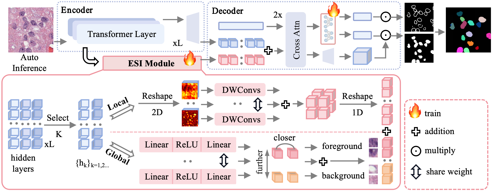

# Implementation of 《DenseSAM: Semantic Enhance SAM For Efficient Dense Object Segmentation》(IJCAI 2025)

[](LICENSE) [](https://www.python.org/) [](https://pytorch.org/)

## Description

DenseSAM replaces location-based prompts with semantic guidance for automatic segmentation in dense scenarios, achieving remarkable performance with only ~3M training parameters. It offers a cost-effective and efficient solution for adapting SAM to dense object segmentation.



## Installation

Create conda env

```shell
conda create -n densesam python=3.10
conda activate densesam
```

Clone codes and install dependences

```shell
git clone https://github.com/imAzhou/DenseSAM.git
cd DenseSAM
pip install -r requirements.txt && pip install -e .
```

## Dataset Preparation

### Dataset Download

You can access detailed information and download the corresponding datasets via the links provided in the table below.

|                                                             Cell Datasets                                                             |                                                                                          Building Datasets                                                                                          |
| :-----------------------------------------------------------------------------------------------------------------------------------: | :-------------------------------------------------------------------------------------------------------------------------------------------------------------------------------------------------: |
|               CoNIC [[paper](https://arxiv.org/abs/2111.14485) [download link](https://conic-challenge.grand-challenge.org)]               |                                  WHU [[paper](https://ieeexplore.ieee.org/abstract/document/8444434) [download link](http://gpcv.whu.edu.cn/data/building_dataset.html)]                                  |
| CPM17 [[paper](https://arxiv.org/abs/1810.13230) [download link](https://drive.google.com/drive/folders/1sJ4nmkif6j4s2FOGj8j6i_Ye7z9w0TfA)] |                                  Inria[[paper](https://ieeexplore.ieee.org/abstract/document/8127684) [download link](https://aistudio.baidu.com/datasetdetail/126725)]                                  |
|       MoNuSeg [[paper](https://ieeexplore.ieee.org/abstract/document/7872382) [download link](https://monuseg.grand-challenge.org/)]       | Massachusetts[[paper](https://www.proquest.com/docview/1500835065?pq-origsite=gscholar&fromopenview=true&sourcetype=Dissertations%20&%20Theses) [download link](https://www.cs.toronto.edu/~vmnih/data/)] |

### Dataset Process

All datasets have been processed into a unified format. Please refer to the processing scripts for each dataset located in the **process_datasets/** directory:

```
# For semantic dataset which no need boundary,like whu,inria and massachusetts.
Step 1: python process_datasets/whu/init_ann.py
Step 2: python process_datasets/whu/gene_coco_panoptic.py

# For instance dataset which need boundary,like conic,cpm17 and monuseg.
Step 1: python process_datasets/conic/create_init_ann.py
Step 2: python process_datasets/conic/gene_coco_panoptic.py
Step 3: python process_datasets/conic/gene_boundary_map.py
```

> Minor differences may exist in the processing of different datasets. For details, please refer to the preprocessing code in each subdirectory under the **process_datasets/** directory.

After configuring the path to your dataset in **config/datasets/dataset_name.py**, you can use the following script to preview the dataset and its annotations to verify that the preprocessing has been performed correctly:

```shell
python process_datasets/browse_dataset.py \
    configs/datasets/conic.py \
    visual_results/gt_visual/conic \
    --vis_nums 5 \
    --show_bbox
```

## Usage

### Training

```shell
python scripts/train.py \
    densesam/configs/datasets/conic.py \
    --record_save_dir logs/conic \
    --print_interval 20 \
    --device cuda:1
```

### Evaluation

```shell
python scripts/test.py \
    logs/conic/2025_01_21_04_31_16/config.py \
    logs/conic/2025_01_21_04_31_16 \
    logs/conic/2025_01_21_04_31_16/checkpoints/best.pth \
    --visual_pred \
    --draw_func draw_cell_color \
    --visual_interval 1 \
    --seed 666
```

### Inference

```shell
python scripts/inference_nometric.py \
    logs/conic/2025_01_21_04_31_16/config.py \
    logs/conic/2025_01_21_04_31_16 \
    logs/conic/2025_01_21_04_31_16/checkpoints/best.pth \
    imgset_dir \
    --visual_interval 1
```

## Contact

If you have any questions, please contact us via email: zhoulyaxx@zju.edu.cn
